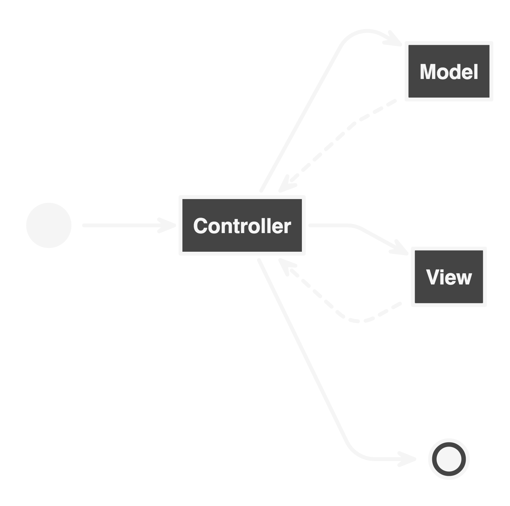
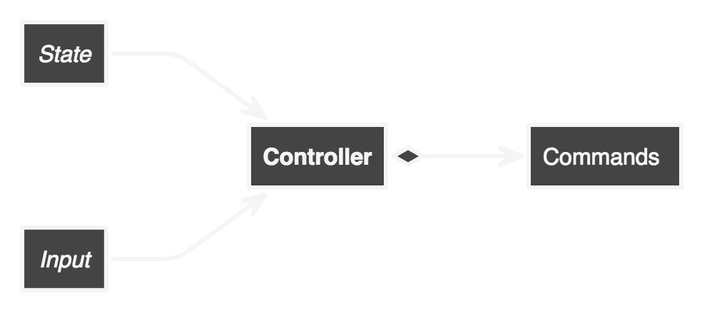
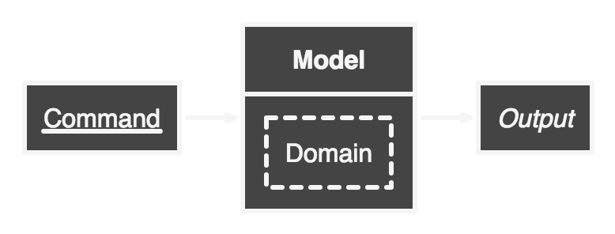
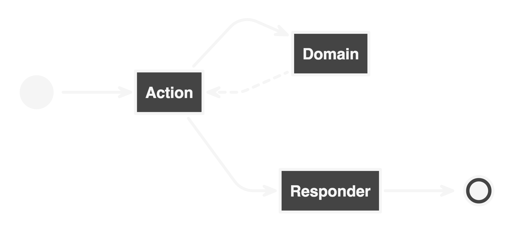
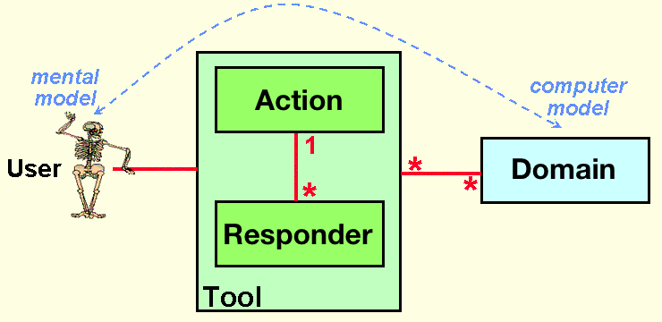

# MVC ➡ ADR

Woody Gilk  
[@shadowhand](https://twitter.com/shadowhand)  
[#mwphp17](https://twitter.com/hashtag/mwphp17)

Note: Who has used MVC?
  Heard of ADR? 
  Used ADR?

----

## Model
## View
## Controller

Note: possibly most widely used design pattern in web

----

It is a software *design pattern*.

----

It separates the *mental mode*  
from the *computer model*.

Note: user ui != computer ui //
  ux = how elegant the transformation is

----

[](http://heim.ifi.uio.no/~trygver/themes/mvc/mvc-index.html)

Note: <3

----

It was made for GUI applications.

Note: history in a minute //
  predates the web

----

Later adopted for web applications.

Note: desktop is different than the web //
  on to history

---

# Timeline

Note: abbreviated

----

## 1978

Trygve Reenskaug invents MVC  
while visiting Xerox PARC.

Note: Try-guhv Reens-kaug //
  Palo Alto Research Center

----

## 1980

MVC is part of Smalltalk-80.

----

## 1988

Published as a design pattern in JOT.

Note: Journal of Object Technology

----

## 1996

Apple WebObjects adopts MVC.

WebObjects is rewritten in Java.

Note: first usage of MVC for web

----

## 2002

Spring framework for Java is released.

Note: first open source usage of web MVC

----

## 2003

Mojavi framework for PHP is released.

Note: first PHP usage

----

## 2004

PRADO is started in January.

Rails first release in July.

----

## 2005

Agavi forked from Mojavi in May.

Django released in July.

Cake announced in August.

Symfony announced in October.

Note: django started in 2003 privately //
  the year of web MVC for php //
  simultaneous scientific discovery //
  PHP only from here on

----

## 2006

CodeIgniter, Zend Framework, SilverStripe

----

## 2007

Kohana

Note: more on Kohana later

----

## 2009

Lithium

*PHP-FIG begins to organize.*

----

## 2011

Laravel, Fuel, Silex, TYPO3

----

## 2012

Phalcon

*et al*

Note: most PHP frameworks now use MVC

---

# Variants

Note: most not applicable for PHP

----

Data flow review.

----

 <!-- .element style="max-height:600px" -->

Note: i am bad at UML //
  i'll pay you to make good diagrams //
  questions?

----

## Model
## View
## Presenter

Note: 1990s at Taligent //
  testing //
  view and model interaction //
  more direct domain access //
  Nette Framework, PHP, 2006

----

## Hierarchical
## MVC

Note: first published July 2000 in Javaworld //
  multiple triads to process a request //
  used by Kohana in 2009 //
  later used by Fuel in 2010

----

## Model
## View
## ViewModel

Note: 2005 by John Gossman @ MS //
  WPF: Windows Presentation Framework //
  Silverlight //
  Knockout JS and ZK (Java) //
  uses data bindings //
  rarely seen in PHP

---

# MVC in PHP

Note: history over

----

**Really** popular.

Note: majority of frameworks use it //
  excluding CMS space //
  popularity is familiarity

----

**Good** starting point.

Note: organizing code = win //
  any structure is better than none //
  separates mental/computer model

----

It **works**.

*Mostly.* <!-- .element: class="fragment" -->

Note: only one design pattern //
  is pretty high level //
  remember the gui?

----

> MVC, as originally envisaged, is not an end-to-end monolithic application pattern, it's a UI pattern.

[*Nate Abele* - 2014](http://paul-m-jones.com/archives/5993#comment-2597)

----

Web applications are fundamentally  
different than desktop applications.

Note: talk about server side apps for a minute //
  the great mismatch

---

# GUI vs Web

Note: life cycle fundamental difference //
  request, response

----

Request ↝ Response

Note: app flow is constant //
  state is maintained all the time //
  http is stateless

----

HTTP is stateless.

Note: if something is nowhere, it can be anywhere

----

How can a desktop pattern work for the web?

----

By meddling with the pattern.

😱 <!-- .element: class="fragment" -->

----

Model was meant to be a domain *gateway*.

Note: gateway/coordinator //
  problem domain //
  application model (mvp reference)

----

View was meant to contain some *logic*.

Note: more purpose than just a template //
  aware of the model data (read only)

----

Controller was meant to handle *input* and *state*.

Note: domain logic does not go here //
  coordinates model output and view input //
  commands

----

Every screen was a *multitude* of MVC triads.

Note: HMVC // widgets //
  dissonance with original intent

---

## #controllerproblems

Note: not universal problems

----

Controller has become synonymous with *resource*.

Note: multiple routes go to the same place //
  users controller //
  products controller //
  blog controller

----

```php
'GET /users' => 'UsersController::all',
'GET /users/{id}' => 'UsersController::one',
'POST /users/{id}' => 'UsersController::update',
'POST /users/{id}/follow' => 'UsersController::follow',
```

Note: how many have seen this? //
  maybe even less routes? //
  one route per controller!

----

Controller has become a *"God Object"*.

Note: anti-pattern //
  separation of concerns //
  multiple HTTP methods = code smell

----

Controllers were meant to be *thin*.

Few dependencies, not much logic. <!-- .element: class="fragment" -->

Note: put domain where it belongs //
  ease of refactoring //
  testability

----

Original purpose of controllers...



Note: state is user state, not application state //
  input and state come from? //
  commands for model and view //
  keep thinking about this

---

## #modelproblems

----

Model has become *storage*.

Note: applications are more than storage //
  where are application rules? //
  where is domain code? //

----

Models were meant to be *thick*.

Many dependencies, not big classes. <!-- .element: class="fragment" -->

Note: gateway for domain //
  lots of coordination //
  authorization //
  application rules //
  storage separate

----

Original purpose of models ...



Note: receives commands //
  produces output //
  coordinates domain, does not replace it

---

## #viewproblems

----

View has become a *template*.

Note: where do headers go? //
  where is content type? //
  API vs HTML formatting //
  multi format of web

----

Views were meant to be *dumb*.

Very little context, not free of logic. <!-- .element: class="fragment" -->
Note: formatting of data //
  specific to type of output //
  pacman chomp chomp

----

Original purpose of views ...


Note: receives data //
  prepares for display

---

# Despair

> ... the more I learn about MVC, the more I think it has little to nothing to do with server-side web applications.

[*Nate Abele* - 2014](http://paul-m-jones.com/archives/5993#comment-2597)

Note: is all lost? //
  is there something better?

---

# Enter ADR

----

## Action
## Domain
## Responder

Note: created by Paul M Jones in 2014 //
  replacement for MVC on the web

----

## Similar to MVC

Action ↔ Controller

Domain ↔ Model

Responder ↔ View

Note: web specific //
  note order

----

## Different from MVC

----

### Action

- does not manipulate Responder
- is always singular <!-- .element: class="fragment" -->

----

### Domain

- does not interact with Responder
- might not be a concrete component <!-- .element: class="fragment" -->

----

### Responder

- does not interact with Domain
- corresponds with Action <!-- .element: class="fragment" -->
- generates a complete response <!-- .element: class="fragment" -->

---

 <!-- .element style="max-height:600px" -->

----

 <!-- .element style="max-height:600px" -->

----

## Benefits?

- clean break from existing terms
- (possibly) better separation of concerns <!-- .element: class="fragment" -->
- domain is a first class citizen <!-- .element: class="fragment" -->

Note: possibly easier to reason about //
  web specific, easier to adapt //
  simplified data flow

---

# Hope

----

Is ADR here to save us all?

Note: my thinking has evolved

----

Time to explore code.

---

# ADR Example

Basic user login.

Note: PSR-7 interfaces

----

```php
public function __invoke(Request $request): Response
{
    // No domain interaction required.
    return $this->responder->response();
}
```

Note: action for showing login

----

```php
public function response(): Response
{
    $content = $this->templates->render('login');
    return $this->htmlResponse($content);
}

private function htmlResponse(string $content): Response
{
    // ...
}
```

Note: responder for showing login

----

```php
public function response(): Response
{
    // ...
}

private function htmlResponse(string $content): Response
{
    $body = $this->streamFactory->createStream($content);
    return $this->responseFactory->createResponse()
        ->withHeader('Content-Type', 'text/html');
        ->withBody($body);
}
```

Note: responder for showing login

----

And now with more **input**.

Note: command bus usage

----

```php
public function __invoke(Request $request): Response
{
    $post = $request->getParsedBody();
    $command = LoginCommand::byUsername(
        $post['username'],
        $post['password']
    );
    return $this->attempt($command);
}

private function attempt(LoginCommand $command): Response
{
    // ...
}
```

Note: post login action

----

```php
private function attempt(LoginCommand $command): Response
{
    try {
        $user = $this->bus->handle($command);
    } catch (LoginFailedException $e) {
        return $this->responder->failed($command, $e);
    }

    return $this->success($user);
}

private function success(User $user): Response
{
    // ...
}
```

Note: post login action //
  domain exception

----

```php
private function attempt(LoginCommand $command): Response
{
    // ...
}

private function success(User $user): Response
{
    $this->session->set('userid', $user->id);
    $this->session->set('username', $user->username);
    return $this->responder->redirect('/user/profile');
}
```

Note: post login action

----

```php
public function failed(
    LoginCommand $command,
    LoginFailedException $e
): Response
{
    $data = [
        'input' => $command->toArray(),
        'errors' => $e->getErrors(),
    ]
    $content = $this->templates->render('login_failed', $data);
    return $this->htmlResponse($content);
}
```

Note: post login responder //
  html response is reused

----

```php
public function failed(/* ... */): Response
{
    // ...
}

public function redirect(string $target): Response
{
    return $this->responseFactory->createResponse(302)
        ->>withHeader('Location', $target);
}
```

Note: post login responder

---

# Do we need ADR?

Note: or "Does this work with MVC?" //
  my thinking has changed

----

What about all that life cycle stuff?

MVC is a design pattern. <!-- .element: class="fragment" -->

Note: not an architecture pattern

----


----



----

> The point here is that the domain should be utterly unaware of what presentations may be used with it.

[*Martin Fowler* - 2006](https://martinfowler.com/eaaDev/SeparatedPresentation.html)

----

Don't let MVC dictate your domain architecture.

Keep domain code out of presentation code. <!-- .element: class="fragment" -->

Use what works for you.<!-- .element: class="fragment" -->

Note: remember what mvc is and isn't //
  adr isn't actually radical

---

Everything will be okay.  
😎

---

# fin.

Questions?

---

### My Name is Woody Gilk

- I live in Grand Marais, Minnesota.
- I like code, food, bikes, and beer.
- I work remotely for [RoundingWell](https://roundingwell.com/).
- Find me everywhere as **shadowhand**.

More at [talks.shadowhand.me](https://talks.shadowhand.me).

---

Go forth.  
Make stuff.  
Be awesome.


Note: JoindIn link
